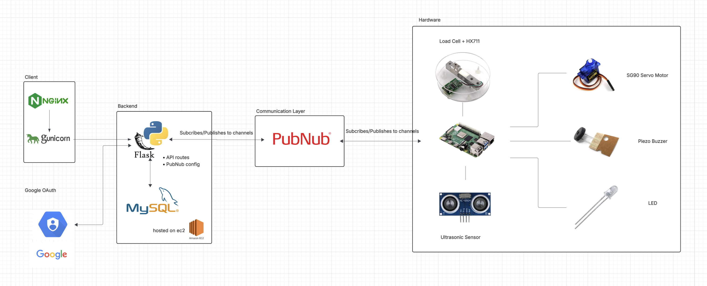
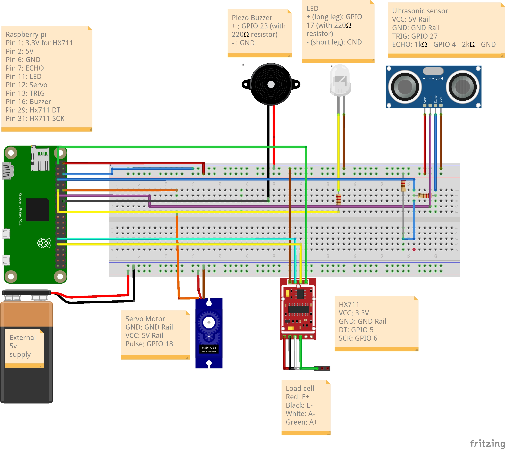

# 📦 Parsley - Smart Parcel Delivery Box

<p align="center">
  
</p>

<p align="center">
  <strong>A secure, IoT-enabled smart parcel management system for contactless deliveries</strong>
</p>

<p align="center">
  <a href="#-key-features">Features</a> •
  <a href="#️-system-architecture">Architecture</a> •
  <a href="#-tech-stack">Tech Stack</a> •
  <a href="#-getting-started">Getting Started</a> •
  <a href="#-deployment">Deployment</a>
</p>

---
## Key Features

### 📦 Parcel Registration & Tracking
- **Register Parcels** - Link incoming parcels to your account using the parcel ID
- **Active Parcels View** - See all parcels awaiting delivery or collection
- **Collection History** - View previously collected parcels with timestamps
- **Real-time Status Updates** - Dashboard refreshes automatically when parcel status changes

### 🔓 Remote Box Control
- **Unlock Box** - Remotely unlock your delivery box from the web interface
- **Lock Box** - Secure the box after collection with one click
- **Audio Feedback** - Buzzer confirms lock/unlock actions on the physical box

### 📬 Automatic Delivery Detection
- **Weight Sensing** - Load cell detects when a parcel is placed in the box
- **Instant Notifications** - Get notified immediately when your parcel arrives
- **Collection Verification** - System checks if box is empty before marking as collected
- **Weight Warning** - Alerts if parcel is still detected during collection attempt

### 💡 Motion-Activated Lighting
- **Proximity Detection** - Ultrasonic sensor detects approach within 50cm
- **Auto-Light** - LED automatically illuminates when someone approaches the box
- **Standalone Operation** - Works independently without internet connection

### 🔐 Secure Access
- **Google Sign-In** - Quick authentication with your Google account
- **Personal Dashboard** - Each user sees only their own parcels
- **Box Permissions** - Can only unlock boxes containing your parcels

---

## 🏗️ System Architecture




### 📡 Data Flow

1. **User Authentication**: Google OAuth → Flask → JWT Cookie
2. **Parcel Registration**: Web UI → Flask API → MySQL Database
3. **Box Unlock Command**: Web UI → Flask → PubNub → Raspberry Pi → Servo
4. **Delivery Detection**: Load Cell → Raspberry Pi → PubNub → Flask → User Notification
5. **Collection Verification**: Web UI → Flask → PubNub → Load Cell → Weight Check

### 📻 PubNub Channels

| Channel | Direction | Purpose |
|---------|-----------|---------|
| `box-{box_id}` | Server → Pi | Sends lock/unlock commands to servo motor |
| `user-{user_id}` | Server → Browser | Real-time notifications to user's dashboard |
| `parcel-delivery` | Pi → Server | Load cell reports delivery detection events |
| `load-cell-control-{box_id}` | Server → Pi | Triggers weight check for collection verification |

**PAM Token Permissions:**
- **Server** - Read/write access to all channel patterns
- **Hardware (Pi)** - Read on `box-*` and `load-cell-control-*`, write on `parcel-delivery` and `user-*`
- **User (Browser)** - Read-only on their own `user-{id}` channel

---

## 🛠️ Tech Stack

### Backend
- **Python 3.7+** - Core programming language
- **Flask 3.1** - Web framework
- **SQLAlchemy 2.0** - ORM & database toolkit
- **Gunicorn** - WSGI HTTP server
- **PyJWT** - Authentication tokens

### Frontend
- **JavaScript (ES6+)** - Client-side logic
- **Tailwind CSS** - Utility-first styling
- **Jinja2** - HTML template rendering

### Infrastructure
- **MySQL** - Relational database
- **Nginx** - Reverse proxy & SSL termination
- **Ubuntu Server** - Production environment
- **systemd** - Process management

### Services & APIs
- **PubNub** - Real-time messaging with PAM (Access Manager)
- **Google OAuth 2.0** - Authentication provider

### Hardware
- **Raspberry Pi** - IoT controller
- **HX711 + Load Cell** - Weight detection for delivery confirmation
- **SG90 Servo Motor** - Lock/unlock mechanism
- **Piezo Buzzer** - Audio feedback
- **HC-SR04 Ultrasonic Sensor** - Motion/proximity detection
- **LED** - Auto-lighting system

---

## 🚀 Getting Started

### Prerequisites

- Python 3.7+
- MySQL Server (or XAMPP)
- Google Cloud Console account (for OAuth)
- PubNub account (with Access Manager enabled)

### 1. Clone the Repository

```bash
git clone https://github.com/yourusername/delivery-box.git
cd delivery-box
```

### 2. Set Up Virtual Environment

```bash
python3 -m venv venv
source venv/bin/activate  # On Windows: venv\Scripts\activate
pip install -r requirements.txt
```

### 3. Configure Environment Variables

```bash
cp .env.example .env
```

Edit `.env` with your credentials:

```env
# Database Configuration
DB_HOST=localhost
DB_USER=root
DB_PASSWORD=your_password_here
DB_NAME=delivery_box
DB_PORT=3306

# Flask Configuration
FLASK_ENV=development
FLASK_DEBUG=True

# Google OAuth
GOOGLE_CLIENT_ID=your_google_client_id_here

# JWT Secret
JWT_SECRET=your_secret_key_change_in_production

# PubNub Configuration
PUBNUB_PUBLISH_KEY=your_publish_key_here
PUBNUB_SUBSCRIBE_KEY=your_subscribe_key_here
PUBNUB_SECRET_KEY=your_secret_key_here
```

### 4. Initialize Database

```bash
mysql -u root < db/schema.sql
```

### 5. Run the Application

```bash
source venv/bin/activate
python app/app.py
```

Visit `http://localhost:5001` in your browser.

---

## 🌐 Deployment

### Production Stack

```
Internet → Nginx (SSL) → Gunicorn → Flask App → MySQL
```

### Server Setup (Ubuntu/AWS EC2)

1. **Install Dependencies**
```bash
sudo apt update
sudo apt install python3-pip python3-venv nginx mysql-server
```

2. **Clone & Configure**
```bash
cd /var/www
git clone https://github.com/yourusername/delivery-box.git
cd delivery-box
python3 -m venv venv
source venv/bin/activate
pip install -r requirements.txt
```

3. **Configure Nginx**
```bash
sudo cp nginx.conf /etc/nginx/sites-available/delivery-box
sudo ln -s /etc/nginx/sites-available/delivery-box /etc/nginx/sites-enabled/
sudo nginx -t
sudo systemctl restart nginx
```

4. **Start Service**
```bash
sudo systemctl daemon-reload
sudo systemctl enable delivery-box
sudo systemctl start delivery-box
```

---

## 🔧 Hardware Setup (Raspberry Pi)

### 📐 Fritzing Wiring Diagram



*Wiring diagram showing Raspberry Pi connections to servo motor, load cell (HX711), piezo buzzer, ultrasonic sensor (HC-SR04), and LED.*

### GPIO Pin Configuration

| Component | GPIO Pin | Description |
|-----------|----------|-------------|
| Servo Motor | GPIO 18 | PWM for lock control |
| Buzzer | GPIO 23 | Audio feedback |
| Load Cell DT | GPIO 5 | HX711 data pin |
| Load Cell SCK | GPIO 6 | HX711 clock pin |
| LED | GPIO 17 | Auto-light indicator |
| Ultrasonic TRIG | GPIO 27 | HC-SR04 trigger pin |
| Ultrasonic ECHO | GPIO 4 | HC-SR04 echo pin |

### Generate Hardware Token (for PAM)

```bash
python3 hardware/get_token.py
```

### Running Hardware Scripts

```bash
# On Raspberry Pi
cd hardware
cp .env.example .env
# Edit .env with your PubNub credentials and token

# Start servo listener (handles lock/unlock commands)
python3 servo_and_buzzer.py

# Start load cell monitor (detects deliveries)
python3 load_cell.py

# Start auto-light system (standalone - no PubNub required)
python3 ultrasonic_led.py
```

### 💡 Auto-Light System

The ultrasonic + LED module is a standalone motion-activated lighting system:
- Detects motion within 50cm using the HC-SR04 ultrasonic sensor
- Automatically turns on LED when motion is detected
- LED stays on for 10 seconds before turning off
- Runs independently without PubNub connection

---

## 🔒 Security Features

### 🔐 Data in Transit

All data transmitted between components is encrypted:

| Connection | Security Mechanism |
|------------|--------------------|
| Browser ↔ Server | **HTTPS/TLS** - SSL certificates via Nginx (Let's Encrypt) |
| Server ↔ PubNub | **TLS 1.2+** - All PubNub SDK connections use SSL |
| Server ↔ Database | **Local socket** - MySQL on same server, no network exposure |
| Pi ↔ PubNub | **TLS 1.2+** - Encrypted pub/sub messaging |
| Google OAuth | **HTTPS** - OAuth 2.0 token exchange over TLS |

### 🗄️ Data at Rest

Sensitive data is protected when stored:

| Data | Protection Method |
|------|-------------------|
| User passwords | Not stored (Google OAuth handles authentication) |
| JWT secrets | Environment variables, not in codebase |
| PubNub keys | Environment variables with PAM token expiration |
| Database | MySQL on private server, no public access |
| Session tokens | httpOnly, Secure, SameSite cookies (7-day expiry) |

### ✅ Additional Security Measures

- **PubNub PAM** - Token-based access control with channel-level permissions
- **Input Validation** - Server-side request validation on all API endpoints
- **SQL Injection Prevention** - Parameterized queries via SQLAlchemy ORM
- **CSRF Protection** - SameSite cookie policy prevents cross-site attacks


---

## 🙏 Acknowledgements

- [PubNub](https://www.pubnub.com/) - Real-time messaging infrastructure
- [Tailwind CSS](https://tailwindcss.com/) - Utility-first CSS framework
- [Flask](https://flask.palletsprojects.com/) - Python web framework
- [Raspberry Pi Foundation](https://www.raspberrypi.org/) - IoT hardware platform
- [ExplainingComputers - Servo Motors](https://www.explainingcomputers.com/pi_servos_video.html) - Servo motor tutorial

